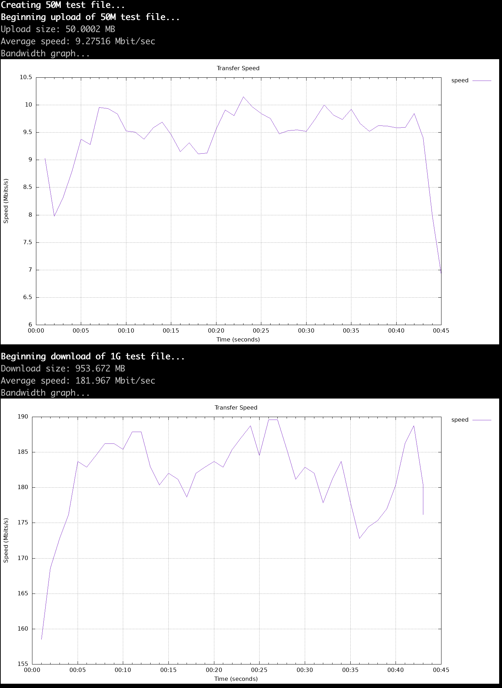

# Serverless Speedtest 
## Overview
This project aims to provide a carrier neutral speedtest mechanism for those who would like to check their bandwidth availabilty via the command-line, leveraging Fastly's Compute@Edge platform to provide consistent synthetic testing data from their global network of POPs.

For more information on Fastly's Compute@Edge please visit: [https://www.fastly.com/products/edge-compute/serverless](https://www.fastly.com/products/edge-compute/serverless) 

If everything works, you should be able to see something like this:



## Caveats
While the basic speed tests should work in most *nix like OS, the application which provides the graph of "bandwidth over time" only works in iTerm2 on OSX for now. 

## Installation


No matter if you run this in Docker, or run it from the command line, you will need to clone the repo: `git clone https://github.com/chrisbuckley/serverless-speedtest.git`

Once cloned, decide your path...

## Docker
Docker is probably the simplest way. To build and run the image:
`docker build -t speedtest .`

Once built, you can then run your tests:

```docker run -t speedtest down 100M```

```docker run -t speedtest up 50M```

etc...

Run without arguments to see a list of options.

## Command Line
Command line access is possible, however there are some requirements. If you do not have said dependencies, you can run ```./requirements.sh``` - however it is purely geared for OSX and thus Linux and other users will not have a fun time.

Once you think it's working, you can then run:

```./test.sh down 100M```

```./test.sh up 50M```

etc...

Run without arguments to see a list of options.

## Contributors
* [Jim Rainville](https://github.com/jimrain) 
* [Mark Richards](https://github.com/markrichards)
* [Chris Buckley](https://github.com/chrisbuckley)

Huge thank-you to [Copperlight](https://copperlight.github.io/shell/measuring-transfer-speed-over-time-with-curl/) for the gift of graphs, and [mjpost](https://github.com/mjpost/bin/blob/master/imgcat) for the awesome bash based image renderererer.

